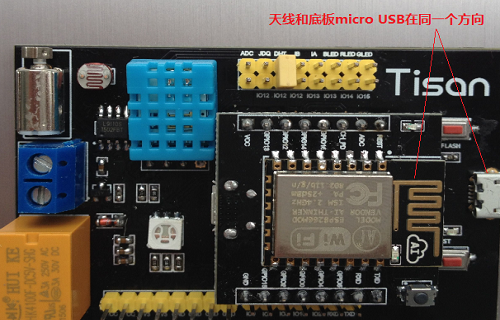
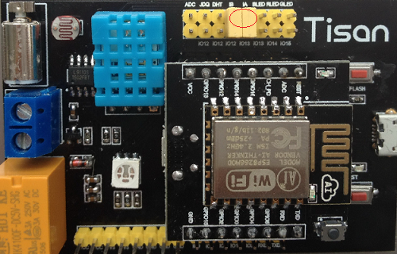
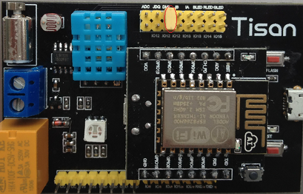
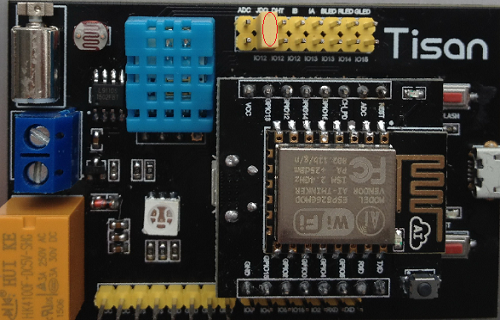

# 示例项目  
如果还不想编写代码，可直接烧写程序进行快速体验所有示例项目！直接下载示例项目所有的[默认固件](http://pan.baidu.com/s/1nttObVj)，具体烧录方法可参考[开发环境](environment.md)关于固件烧录的方法说明，记得每个示例项目所需要的跳帽连接，具体可参考下面的图。      
在使用板子之前，请注意核心板插在底板上的方向，如下图所示：  
  

### 1.RGB三色灯例子   
用跳帽短接三色灯和模块GPIO：BLED连GPIO13，RlED连GPIO14，GLED连GPIO15,如下图：  
  
在user_main文件中添加文件引用：  
```c 
#include "objects/led.h"  
```
在user_main文件的user_init函数中添加以下代码：  
```c
led_object_init(); 
```
### 2.电机的例子  
用跳帽短接电机驱动和模块GPIO：IA连GPIO13，IB连GPIO12，如下图：  
   
在user_main文件中添加文件引用：  
```c 
#include "objects/motor.h"  
```
在user_main文件的user_init函数中添加以下代码：  
```c
motor_object_init(); 
```
### 3.温度的例子  
用跳帽短接DHT11和模块GPIO：DHT连GPIO12,如下图：  
  
在user_main文件中添加文件引用：  
```c 
#include "objects/temperature.h"  
```
在user_main文件的user_init函数中添加以下代码：  
```c
temperature_object_init(); 
```
### 4.湿度的例子
用跳帽短接DHT11和模块GOIO：DHT连GPIO12，同温度的例子  
在user_main文件中添加文件引用：  
```c 
#include "objects/humiture.h"  
```
在user_main文件的user_init函数中添加以下代码：  
```c
humiture_object_init(); 
```
### 5.继电器的例子
用跳帽短接继电器和模块GPIO：JDQ连GPIO12，如下图：  
  
在user_main文件中添加文件引用：  
```c 
#include "objects/jdq.h"  
```
在user_main文件的user_init函数中添加以下代码：  
```c
jdq_object_init(); 
``` 


